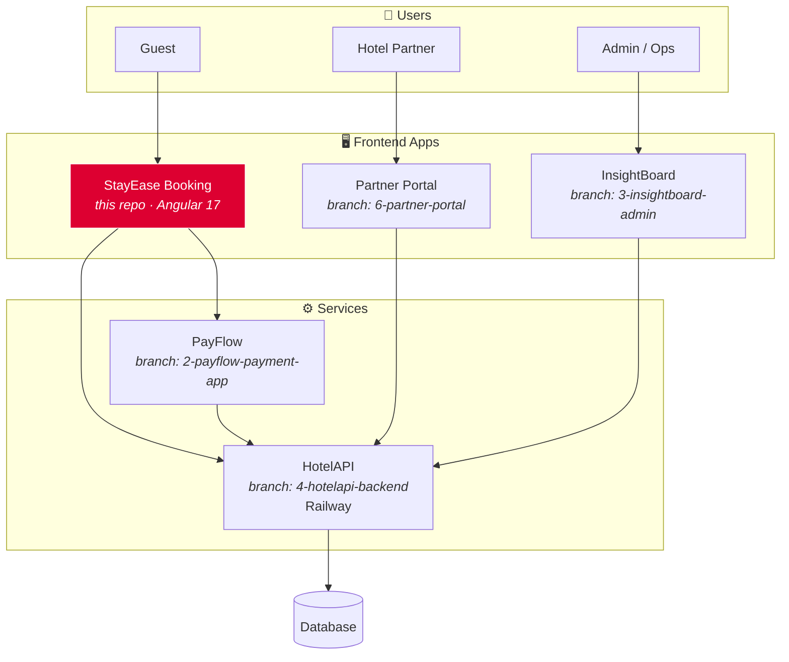

<div align="center">

# 🏨 StayEase

### Open-source hotel booking platform — built end-to-end with Angular, deployed live, designed for real-world checkout flows.

[](https://angular.io/)
[](https://www.typescriptlang.org/)
[](https://vercel.com/)
[](#-testing)
[](LICENSE)
[](#-contributing)

**🌐 Live App:** [stayvora.co.in](https://stayvora.co.in)  ·  **🔌 API:** [hotel-api-production-447d.up.railway.app](https://hotel-api-production-447d.up.railway.app)

</div>

---

## 📖 About

**StayEase** (deployed as **Stayvora**) is a guest-facing hotel discovery and checkout experience designed around a real production problem: how do you let users browse rooms, hold inventory while they pay, recover abandoned bookings, and confirm a stay — all without a re-architect every quarter?

This repository is the **booking frontend** of a larger ecosystem. It's built with Angular 17 standalone components and Signals-based state management, ships with Jest unit tests and Playwright end-to-end coverage, and is deployed continuously to Vercel.

> 🎯 **Why open source?** I'm building this in public to share an end-to-end booking-platform reference for other Angular developers and to grow it into a community-improvable codebase for the hospitality stack.

---

## ✨ Features

### Guest experience
- 🔍 Real-time room search with filters for city, dates, guest count, and price
- 🏠 Room detail pages with gallery, amenities, and live availability checks
- 🛒 Checkout flow with **hold creation** and **resumable booking recovery** for abandoned sessions
- 🔐 Authentication, booking history, and wishlist
- ✅ Booking confirmation, invoice, and voucher access post-payment
- 📱 Fully responsive premium guest UI

### Engineering
- ⚡ Angular 17 standalone components — no NgModule overhead
- 📡 Signals-based reactive state management
- 🧪 Jest for unit testing, Playwright for e2e (with separate `prod` config)
- 🔧 ESLint + TypeScript strict mode
- 🚀 GitHub Actions CI/CD → Vercel deployment

---

## 🏗️ Architecture

StayEase Booking is one of several apps in a hotel-platform monorepo. Each component lives on its own branch and is deployed independently.



> The red node is this repository. Other components are linked under [Connected Apps](#-connected-apps).

---

## 🛠️ Tech Stack

| Layer | Technology |
| --- | --- |
| Framework | Angular 17 (standalone components) |
| Language | TypeScript (strict mode) |
| State | Angular Signals |
| HTTP | Angular HttpClient |
| Routing | Angular Router |
| Styling | SCSS + CSS custom properties |
| Unit Tests | Jest |
| E2E Tests | Playwright (with prod config) |
| Linting | ESLint |
| CI/CD | GitHub Actions |
| Hosting | Vercel |
| Backend | Hosted separately on Railway *(see HotelAPI branch)* |

---

## 🚀 Quick Start

### Prerequisites
- Node.js **18+**
- npm **9+**

### Setup

```bash
# Clone
git clone https://github.com/athitthiyan/stayease-booking-app.git
cd stayease-booking-app

# Install
npm install

# Run dev server
npm start
# → http://localhost:4200
```

### Environment

Create a `src/environments/environment.ts` pointing to a backend API. By default the dev environment expects the HotelAPI service to be reachable. To use the live production API:

```typescript
export const environment = {
  production: false,
  apiBaseUrl: 'https://hotel-api-production-447d.up.railway.app',
};
```

---

## 🧪 Testing

```bash
# Unit tests (Jest)
npm test

# Unit tests with coverage
npm run test:coverage

# E2E tests (Playwright)
npx playwright test

# E2E against production
npx playwright test --config=playwright.prod.config.ts
```

---

## 📁 Project Structure

```
src/app/
├── core/
│   ├── models/          # Domain models & interfaces
│   └── services/        # Singleton services (auth, booking, http)
├── shared/
│   └── components/      # Reusable UI components
└── features/
    ├── landing/             # Home & discovery
    ├── search-results/      # Filtered room listings
    ├── room-detail/         # Gallery, amenities, availability
    ├── checkout/            # Hold creation + payment handoff
    └── booking-confirmation/  # Voucher, invoice, post-booking
```

---

## 🔌 Connected Apps

The platform is split across branches, each independently deployable:

| App | Branch | Purpose |
| --- | --- | --- |
| 💳 **PayFlow** | [`2-payflow-payment-app`](https://github.com/athitthiyan/payflow-payment-app) | Payment processing & gateway integrations |
| 📊 **InsightBoard** | [`3-insightboard-admin`](https://github.com/athitthiyan/insightboard-admin) | Admin analytics & operations dashboard |
| 🌐 **HotelAPI** | [`4-hotelapi-backend`](https://github.com/athitthiyan/hotelapi-backend) | Shared backend API (Railway) |
| 🏨 **Partner Portal** | [`6-partner-portal`](https://github.com/athitthiyan/partner-portal) | Hotel-partner inventory & operations |

---

## 📸 Screenshots

> _Screenshots coming soon. In the meantime, the live app at [stayvora.co.in](https://stayvora.co.in) is the most up-to-date preview._

---

## 🗺️ Roadmap

- [x] Live booking flow with hold + recovery
- [x] Jest unit tests + Playwright e2e suite
- [x] CI/CD via GitHub Actions → Vercel
- [ ] Component-level Storybook for the design system
- [ ] i18n support (Tamil, Hindi, English)
- [ ] Booking sharing & gift vouchers
- [ ] Loyalty / repeat-guest program
- [ ] Mobile app shell (Capacitor)
- [ ] Public OpenAPI spec for HotelAPI
- [ ] Open issues for first-time contributors (good-first-issue labels)

---

## 🤝 Contributing

This project is open to contributions — bug reports, feature ideas, PRs, and design feedback are all welcome.

1. Fork the repository
2. Create a feature branch: `git checkout -b feat/your-feature`
3. Run `npm test` and `npx playwright test` before pushing
4. Open a Pull Request describing the change and the user impact

If you're new to Angular Signals, the `features/` folder is a friendly entry point — most components are self-contained.

---

## 📜 License

This project is licensed under the [MIT License](LICENSE).

---

## 🙏 Acknowledgments

Built and maintained by [@athitthiyan](https://github.com/athitthiyan). Developed with the help of [Claude Code](https://claude.com/product/claude-code) for AI-assisted refactors, test generation, and architecture review.

If StayEase has been useful to you, a ⭐ on the repo goes a long way.