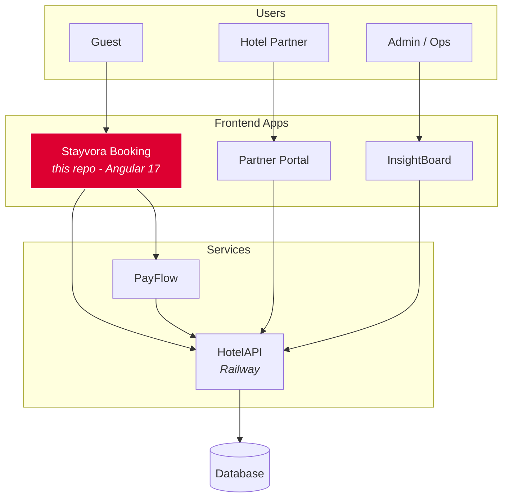
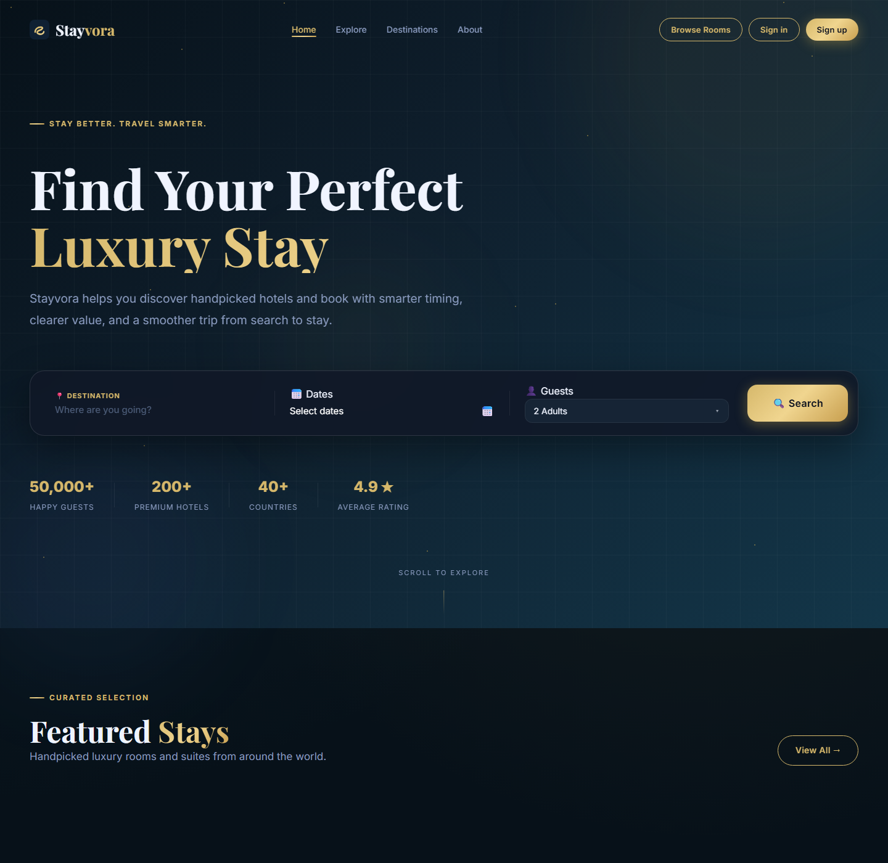
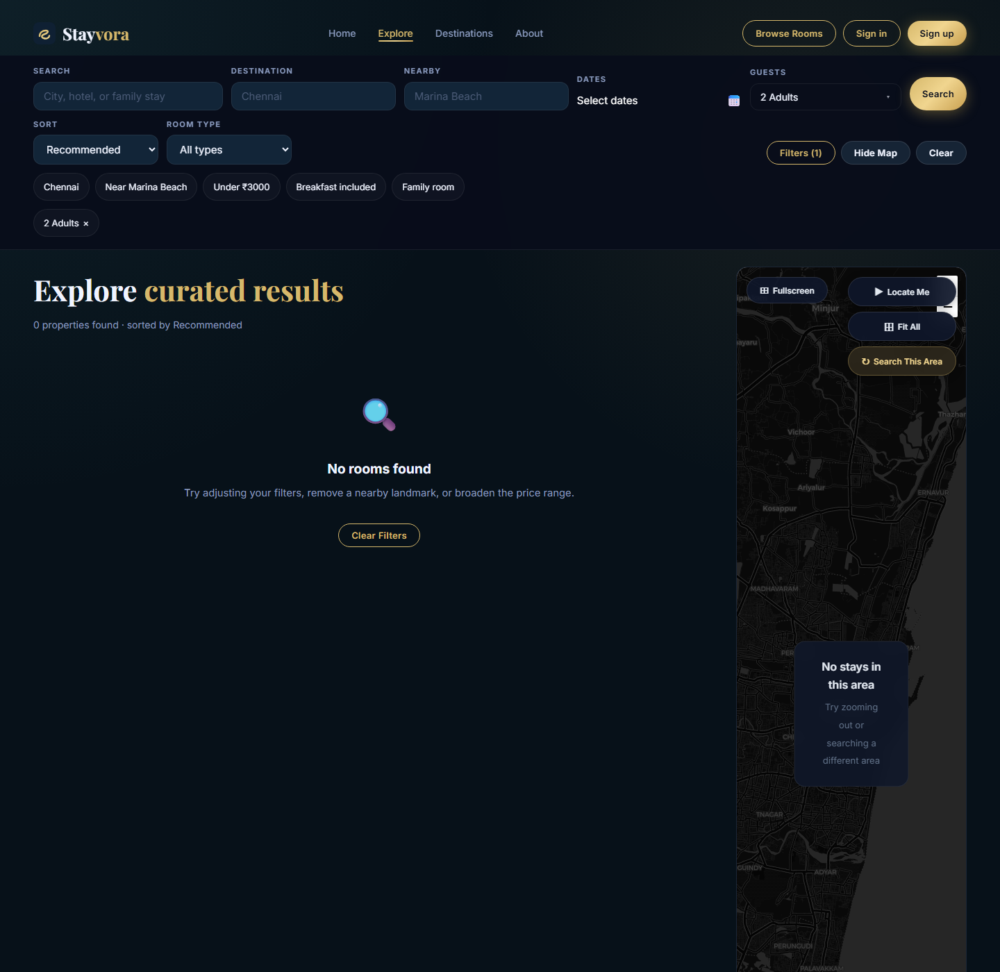
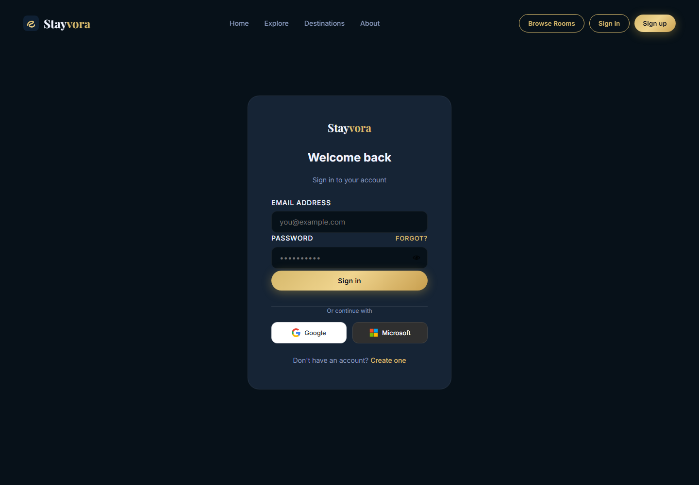

<div align="center">

# Stayvora

Open-source hotel booking frontend built with Angular, deployed live, and designed for real checkout flows.

[](https://angular.io/)
[](https://www.typescriptlang.org/)
[](https://vercel.com/)
[](https://github.com/athitthiyan/stayease-booking-app/actions/workflows/ci.yml)
[](LICENSE)
[](CONTRIBUTING.md)

**Live App:** [stayvora.co.in](https://stayvora.co.in) | **API:** [hotel-api-production-447d.up.railway.app](https://hotel-api-production-447d.up.railway.app)

</div>

---

## About

**Stayvora** is a guest-facing hotel discovery and checkout experience designed around a real production problem: letting users browse rooms, hold inventory while they pay, recover abandoned bookings, and confirm a stay without rebuilding the platform every quarter.

This repository is the booking frontend of the wider Stayvora platform. It is built with Angular 17 standalone components and Signals-based state management, ships with Jest unit tests and Playwright end-to-end coverage, and is deployed continuously to Vercel.

## Features

### Guest Experience

- Real-time room search with filters for city, dates, guest count, and price
- Room detail pages with gallery, amenities, and live availability checks
- Checkout flow with hold creation and resumable booking recovery for abandoned sessions
- Authentication, booking history, and wishlist
- Booking confirmation, invoice, and voucher access after payment
- Responsive guest UI for desktop and mobile

### Engineering

- Angular 17 standalone components
- Signals-based reactive state management
- Jest unit tests and Playwright e2e coverage
- ESLint and TypeScript strict mode
- GitHub Actions CI with production build verification
- Production deployment through Vercel

## Architecture



## Tech Stack

| Layer | Technology |
| --- | --- |
| Framework | Angular 17 standalone components |
| Language | TypeScript strict mode |
| State | Angular Signals |
| HTTP | Angular HttpClient |
| Routing | Angular Router |
| Styling | SCSS and CSS custom properties |
| Unit Tests | Jest |
| E2E Tests | Playwright |
| Linting | ESLint |
| CI/CD | GitHub Actions |
| Hosting | Vercel |
| Backend | HotelAPI on Railway |

## Quick Start

### Prerequisites

- Node.js 18+
- npm 9+

### Setup

```bash
git clone https://github.com/athitthiyan/stayease-booking-app.git
cd stayease-booking-app
npm install
npm start
```

The dev server runs at [http://localhost:4200](http://localhost:4200).

### Production Build

```bash
npm run build:prod
```

The production build uses `src/environments/environment.production.ts`, points at the hosted HotelAPI service, and keeps the public booking experience enabled unless `maintenanceMode` is explicitly set to `true`.

## Testing

```bash
npm test
npm run test:coverage
npm run e2e
npx playwright test --config=playwright.prod.config.ts
```

## Project Structure

```text
src/app/
|-- core/
|   |-- models/
|   `-- services/
|-- shared/
|   `-- components/
`-- features/
    |-- landing/
    |-- search-results/
    |-- room-detail/
    |-- checkout/
    `-- booking-confirmation/
```

## Connected Apps

| App | Repository | Purpose |
| --- | --- | --- |
| PayFlow | [athitthiyan/payflow-payment-app](https://github.com/athitthiyan/payflow-payment-app) | Payment processing and gateway integrations |
| InsightBoard | [athitthiyan/insightboard-admin](https://github.com/athitthiyan/insightboard-admin) | Admin analytics and operations dashboard |
| HotelAPI | [athitthiyan/hotelapi-backend](https://github.com/athitthiyan/hotelapi-backend) | Shared backend API |
| Partner Portal | [athitthiyan/partner-portal](https://github.com/athitthiyan/partner-portal) | Hotel-partner inventory and operations |

## Screenshots

| Home | Search | Sign In |
| --- | --- | --- |
|  |  |  |

## Roadmap

- [x] Live booking flow with hold and recovery
- [x] Jest unit tests and Playwright e2e suite
- [x] CI/CD via GitHub Actions and Vercel
- [ ] Component-level Storybook for the design system
- [ ] i18n support for Tamil, Hindi, and English
- [ ] Booking sharing and gift vouchers
- [ ] Loyalty and repeat-guest program
- [ ] Mobile app shell with Capacitor
- [ ] Public OpenAPI spec for HotelAPI
- [ ] Good-first-issue backlog for new contributors

## Contributing

This project is open to contributions: bug reports, feature ideas, pull requests, and design feedback are welcome. Start with [CONTRIBUTING.md](CONTRIBUTING.md) and please follow the [Code of Conduct](CODE_OF_CONDUCT.md).

## License

This project is licensed under the [MIT License](LICENSE).

## Acknowledgments

Built and maintained by [@athitthiyan](https://github.com/athitthiyan). If Stayvora is useful to you, a star on the repo helps the project reach more Angular and travel-tech builders.
